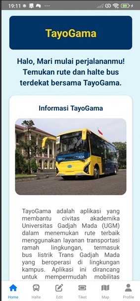
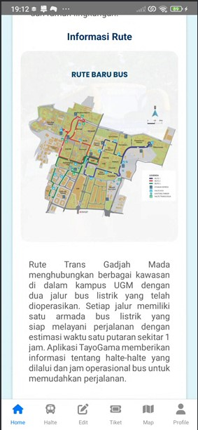
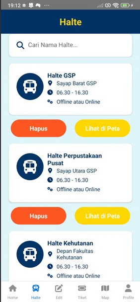
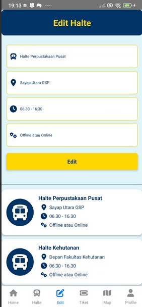
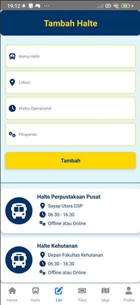
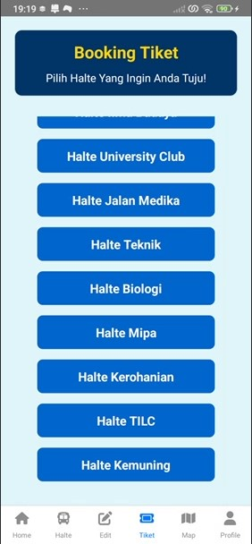
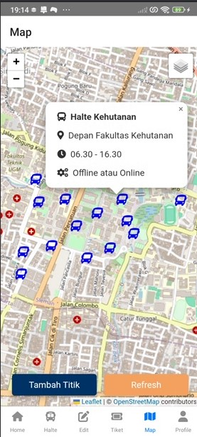
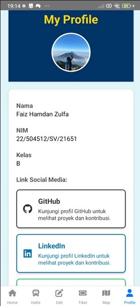

---

## 🚌 **TayoGama**

**TayoGama** adalah aplikasi yang dirancang untuk mendukung mobilitas civitas akademika Universitas Gadjah Mada (UGM) dengan cara yang efisien dan ramah lingkungan. Aplikasi ini menyediakan informasi tentang rute transportasi ramah lingkungan, termasuk bus listrik **Trans Gadjah Mada**, serta berbagai fitur lainnya untuk mempermudah perjalanan di dalam kampus UGM.

---

## ✨ **Fitur Utama**:

🚏 **Pemetaan Halte Transportasi Gadjah Mada**  
Peta interaktif yang menampilkan halte-halte bus listrik Trans Gadjah Mada yang menghubungkan berbagai kawasan di kampus UGM. Pengguna dapat mencari nama halte, lokasi halte, dan jam operasional dengan mudah.

➕ **Penambahan Titik Informasi Halte**  
Pengguna dapat menambah informasi tentang titik halte baru yang mungkin belum tercatat, serta memperbarui data halte yang ada.

🎫 **Pemesanan Tiket**  
Pengguna dapat melakukan pemesanan tiket secara langsung sesuai dengan lokasi halte yang ingin dinaiki dan tujuan yang dituju.

---

## 🛠 **Komponen Pembangun Produk**

### *1. Antarmuka Pengguna (Frontend)*

- **HTML**: Struktur dokumen dan elemen UI seperti peta, formulir input, dan tombol.
- **CSS**: Desain dan tata letak halaman untuk memastikan pengalaman pengguna yang nyaman dan mudah digunakan, termasuk animasi dan transisi.
- **JavaScript**: Pengendalian interaksi, seperti  pencarian halte, dan integrasi API untuk memuat data secara dinamis.

### *2. Library dan Framework*

- **Leaflet.js**: Library JavaScript untuk membuat peta interaktif dan menampilkan posisi halte secara real-time.
- **Fetch API**: Untuk komunikasi antara frontend dan backend, memungkinkan aplikasi mengambil dan mengirimkan data rute dan informasi halte secara efisien.

### *3. Backend*

- **Endpoint API**: Berdasarkan arsitektur REST untuk mengelola data rute dan halte:
  - **`POST /halte`**: Menambahkan data halte baru.
  - **`GET /halte`**: Mengambil data halte yang ada.
  - **`PUT/PATCH /halte`**: Melakukan edit data halte yang sudah ada.

### *4. Sumber Data*

- **Data Rute**: Data rute Trans Gadjah Mada yang diperoleh dari website DPPA UGM.
- **Data Titik Halte**: Titik-titik halte Trans Gadjah Mada yang ada di lingkungan kampus UGM, yang harus dikelola dan diperbarui secara interaktif.

---

## 🖼 **Tangkapan Layar Komponen Penting Produk**

### *1. Home*  
🏠 **Halaman Utama**  
Halaman utama aplikasi yang menyambut pengguna dengan informasi umum mengenai transportasi ramah lingkungan di UGM dan memberikan akses mudah ke berbagai fitur aplikasi.

### *2. List Data*  
📋 **Daftar Halte**  
Menampilkan daftar halte bus listrik Trans Gadjah Mada yang tersedia, lengkap dengan informasi nama halte, lokasi, dan jadwal operasional bus.

### *3. Edit dan Tambah Data*  
✏ **Formulir Edit dan Tambah Halte**  
Formulir interaktif yang memungkinkan pengguna untuk mengedit atau menambah informasi halte, termasuk mengubah lokasi atau menambah jadwal operasional bus.

  
*Formulir Edit Halte*
  
*Formulir Tambah Halte*

### *4. Tiket*  
🎫 **Pemesanan/Booking Tiket**  
Fitur untuk memesan tiket bus sesuai dengan lokasi halte yang akan dinaiki dan tujuan perjalanan, serta informasi terkait ketersediaan armada bus.

  
*Formulir Tiket*

### *5. Map*  
🗺 **Peta Interaktif**  
Peta interaktif yang menampilkan posisi haltsecara real-time untuk memudahkan navigasi pengguna.

  
*Peta Posisi Halte*

### *6. Profile*  
👤 **Halaman Profil**  
Halaman profil pengguna yang memungkinkan mereka melihat dan mengedit informasi pribadi serta pengaturan terkait preferensi rute transportasi.

  
*Halaman Profil Pengguna*

---

